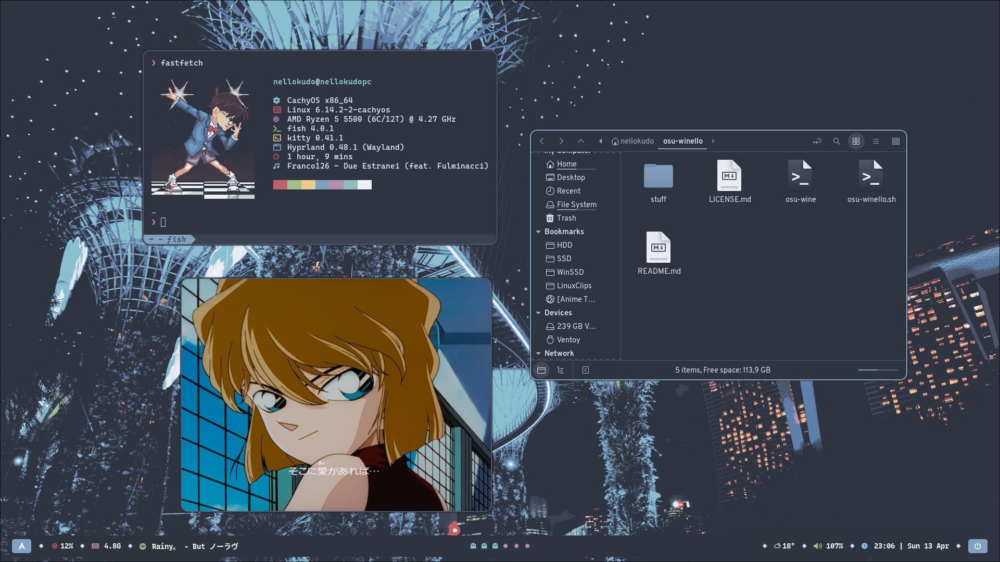
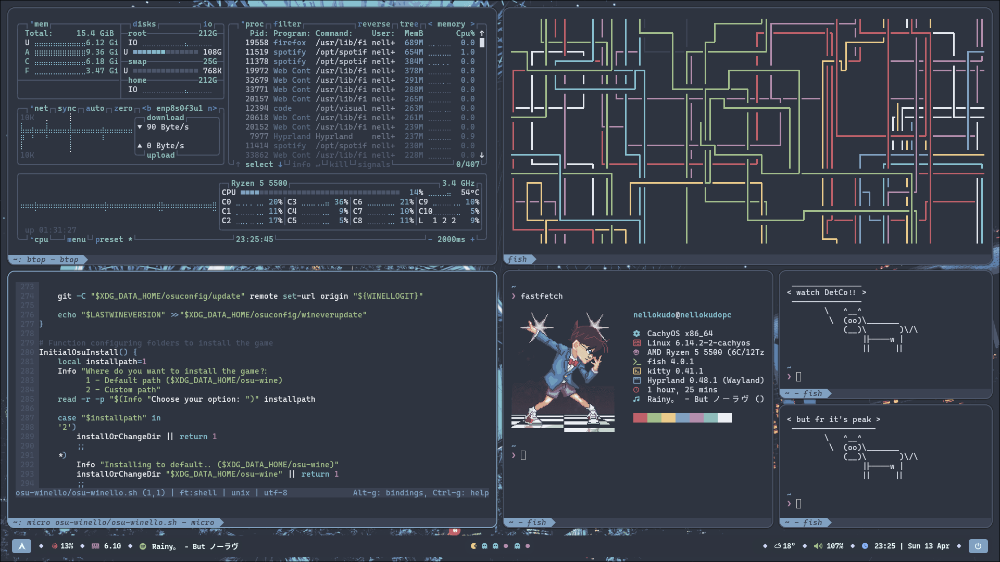
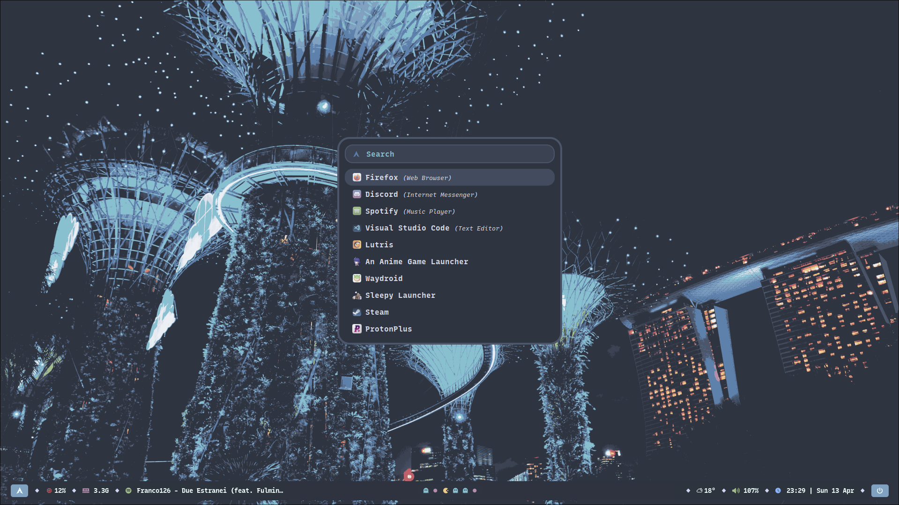
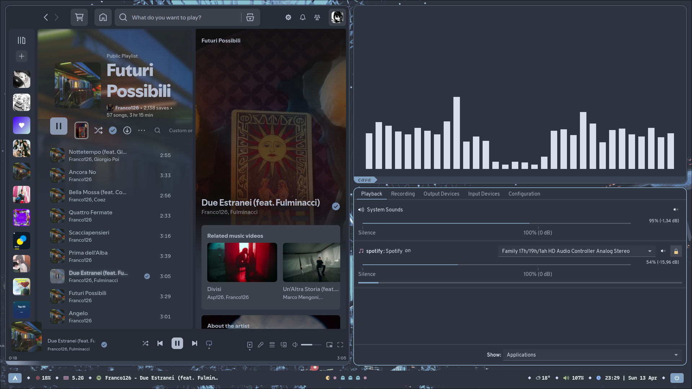
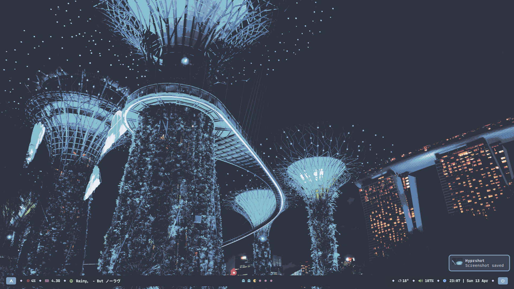

<h1 align="center"> hyprnord-dots </h1>
<p align="center"> A simple, clean Hyprland config with cozy Nord vibes ❄️ </p>

<div align="center">

https://github.com/user-attachments/assets/33b77a0e-abfa-4a52-be50-0113f5b195e0

  &ensp;<a href="#gallery"><kbd> <br> Gallery <br> </kbd></a>&ensp;
  &ensp;<a href="#installation-%EF%B8%8F"><kbd> <br> Installation <br> </kbd></a>&ensp;
  &ensp;<a href="#keybindings"><kbd> <br> Keybindings <br> </kbd></a>&ensp;
  &ensp;<a href="#credits"><kbd> <br> Credits <br> </kbd></a>&ensp;

---

## Gallery
| Floating 🍃 |
|:-:|
||

| Tiled 🖼️ |
|:-:|
||

| Launcher 🔎 |
|:-:|
||

| Spotify 🎼 |
|:-:|
||

| Desktop 🚦 |
|:-:|
||

--- 

## Installation ❄️

For **Arch Linux** based distros, running the install script is enough to have everything up and running!
</div>

```
git clone https://github.com/NelloKudo/hyprnord-dots.git
cd hyprnord-dots
./hyprnord-dots-install.sh
```
<div align="center">

---
The script was written with other distros in mind too — just make sure you install the required packages yourself beforehand, and everything should work just fine.
```
btop dunst fastfetch fish nwg-look hyprland kitty micro nemo rofi-wayland waybar grim slurp swaybg python-pyquery jq wl-clipboard libnotify
```
--- 

## Keybindings

| Keys                                                 | Action                          |
| :--------------------------------------------------- | :------------------------------ |
| <kbd>SUPER</kbd> + <kbd>Q</kbd>                      | Close window                    |
| <kbd>SUPER</kbd> + <kbd>Return</kbd>                 | Open terminal                   |
| <kbd>SUPER</kbd> + <kbd>W</kbd>                      | Open powermenu (rofi)           |
| <kbd>SUPER</kbd> + <kbd>E</kbd>                      | Open file manager (nemo)        |
| <kbd>SUPER</kbd> + <kbd>D</kbd>                      | Open launcher (rofi)            |
| <kbd>SUPER</kbd> + <kbd>J</kbd>                      | Toggle split                    |
| <kbd>SUPER</kbd> + <kbd>Space</kbd>                  | Toggle floating/tiled           |
| <kbd>SUPER</kbd> + <kbd>F</kbd>                      | Toggle fullscreen               |
| <kbd>SUPER</kbd> + <kbd>1/2/3</kbd>                  | Workspace 1/2/3 etc..           |
| <kbd>SUPER</kbd> + <kbd>SHIFT</kbd> + <kbd>1/2</kbd> | Move window to workspace 1/2..  |
| <kbd>SUPER</kbd> + <kbd>M</kbd>                      | Exit Hyprland                   |

### Waybar Commands

| Module         | Action                          | Description                             |
| :------------- | :------------------------------ | :-------------------------------------- |
| **Media**      | Left click                      | Toggle play/pause                       |
|                | Scroll up / down                | Next / Previous song                    |
| **Weather**    | Hover                           | Show weather forecast for next days     |
|                | Left click                      | Open browser with local weather info    |
| **Audio**      | Left click                      | Open `pavucontrol`                      |
|                | Scroll up / down                | Increase / decrease volume by 10        |

*pretty basic ikr*

> 💡 **Tip:** You can point the Weather widget to your city by changing the `location_id` in `~/.config/waybar/weather.py`.

## Credits

</div>

- [u/Derwhondi](https://www.reddit.com/r/OneTruthPrevails/comments/hw191n/pixel_redraw_of_dancing_conan_this_is_from/) for the amazing Conan pixel art! Straight up gorgeous.
- [gh0stzk's dotfiles](https://github.com/gh0stzk/dotfiles) for inspiring me with the Pac-Man workspace thing, it's brilliant.
- [spicetify's Nord theme](https://github.com/Comfy-Themes/Spicetify/blob/main/Comfy/README.md)
- [Nordzy-cursors](https://github.com/guillaumeboehm/Nordzy-cursors)
- [Nordzy-icons](https://github.com/MolassesLover/Nordzy-icon)
- [NordArc-Theme](https://github.com/robertovernina/NordArc)
- [Nordic-wallpapers](https://github.com/linuxdotexe/nordic-wallpapers)
- [Nerd Fonts](https://www.nerdfonts.com/) for existing.
- All the programs used to make the config!
---
  
```
_______________ 
< watch DetCo!! >
 --------------- 
        \   ^__^
         \  (oo)\_______
            (__)\       )\/\
                ||----w |
                ||     ||
```
